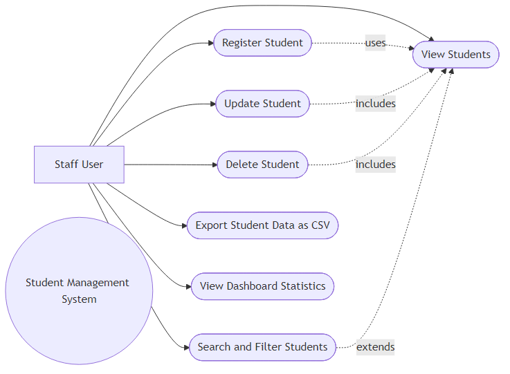
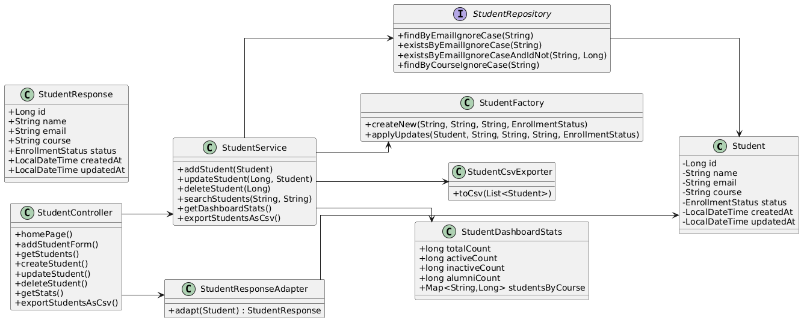
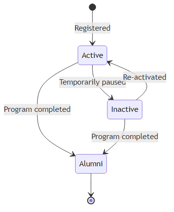
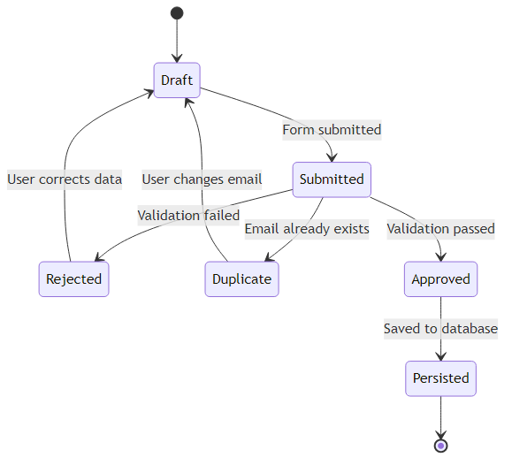
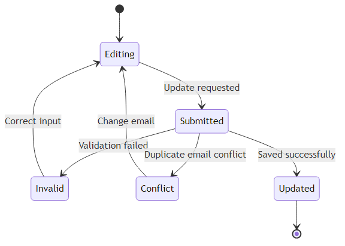
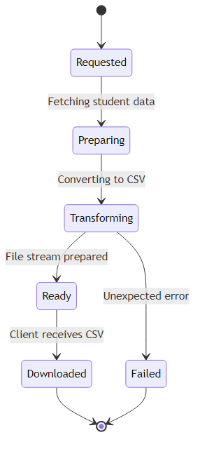
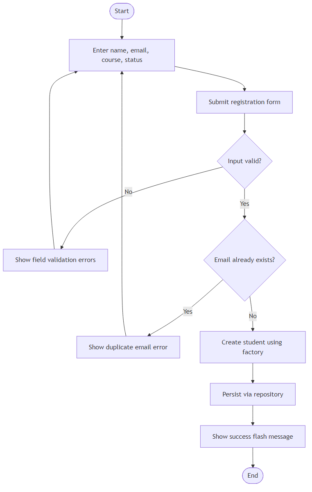
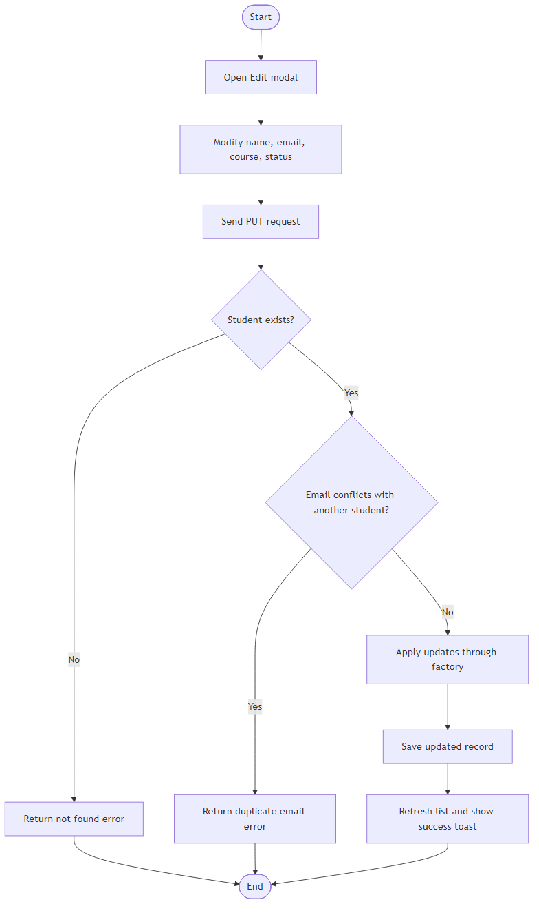
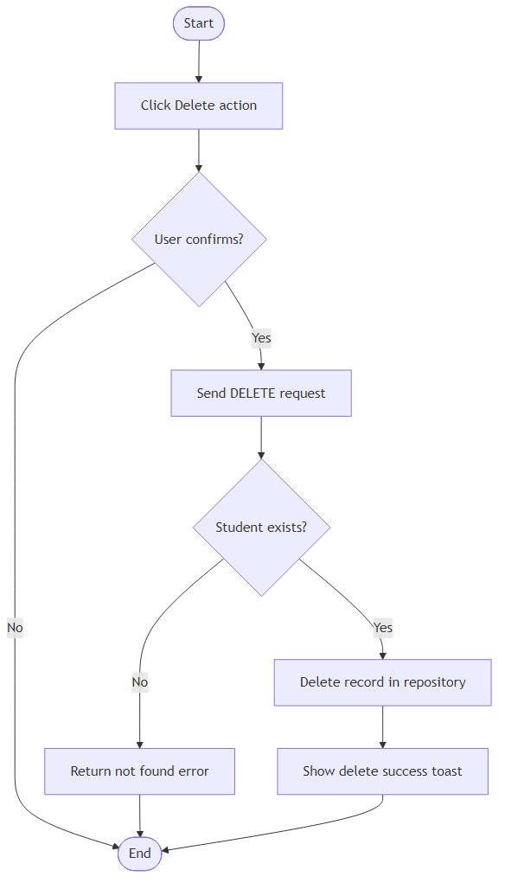
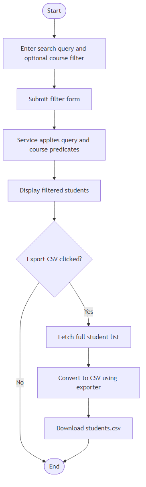

# UE23CS352B - Object Oriented Analysis & Design

# Mini Project Report

## Title

Student Management System

Submitted by:

| NAME | SRN |
| --- | --- |
| <Student 1 Name> | <SRN 1> |
| <Student 2 Name> | <SRN 2> |
| <Student 3 Name> | <SRN 3> |
| <Student 4 Name> | <SRN 4> |

Semester - Section: VI - <Section>

## Faculty Name

<Faculty Name>

January - May 2026

### DEPARTMENT OF COMPUTER SCIENCE AND ENGINEERING

FACULTY OF ENGINEERING

### PES UNIVERSITY

(Established under Karnataka Act No. 16 of 2013) 100ft Ring Road, Bengaluru - 560 085, Karnataka, India

## Problem Statement:

Educational institutes often maintain student details in fragmented spreadsheets or manual records. This leads to duplicate entries, inconsistent updates, and poor visibility into student status. The objective of this project is to build a centralized Student Management System that supports complete lifecycle management of student records using a Java MVC architecture with persistent storage.

## Key Features:

### Major Features / Use Cases

1. Register student with validation and duplicate-email prevention.
2. View all students with status and course details.
3. Update student details and enrollment status.
4. Delete student records safely.

### Minor Features / Use Cases

1. Search students by name, email, course, or status.
2. Filter students by course.
3. Export all student records to CSV.
4. View dashboard statistics (total, active, inactive, alumni, course-wise counts).

## Models:

Use Case Diagram:

Class Diagram:

## State Diagram:

Student lifecycle state diagram:

Registration request state diagram:

Update request state diagram:

Export job state diagram:

Activity Diagrams:

Register student activity diagram:

Update student activity diagram:

Delete student activity diagram:

Search and export activity diagram:

Design Principles, and Design Patterns:

## MVC Architecture used? Yes/No

Yes. The project follows MVC architecture:

- Model: Student, EnrollmentStatus
- View: Thymeleaf page for form, listing, edit and delete actions
- Controller: StudentController and GlobalExceptionHandler
- Service: StudentService
- Repository: StudentRepository

## Design Principles

Single Responsibility Principle:
- StudentService handles business rules.
- StudentCsvExporter handles CSV generation.
- StudentResponseAdapter handles API response adaptation.

Dependency Inversion Principle:
- Controller depends on injected service/adapter abstractions.
- Service depends on injected repository, factory, and exporter collaborators.

Open Closed Principle:
- Export behavior can be extended with new exporter classes without changing StudentService flow.

Interface Segregation Principle:
- Repository exposes focused operations required by service logic.

## <Explanation of principle usage in the project>

The project applies the above principles to keep the code modular, testable, and easy to maintain. Separation of responsibilities and constructor-based dependency injection reduces coupling and supports straightforward unit testing.

## Design Patterns

Creational Pattern - Factory:
- StudentFactory centralizes entity creation and updates.

Structural Pattern - Adapter:
- StudentResponseAdapter converts Student entity objects into StudentResponse API DTOs.

Behavioral Pattern - Strategy-style collaborator:
- StudentCsvExporter encapsulates export behavior independent of service orchestration.

Repository Pattern:
- StudentRepository abstracts persistence and query operations.

## <Explanation of pattern usage in the project>

Patterns are used to keep core business logic clean and extensible. Factory and Adapter reduce duplication and API coupling, while Repository and service layering preserve clear boundaries between persistence, business logic, and presentation.

### Github link to the Codebase: (repository should be public)

https://github.com/<username>/<repository>

## Screenshots

## UI:

Include screenshots here with white background screens as required:

1. Home page dashboard and student list
2. Student registration success flow
3. Duplicate email validation message
4. Student update flow
5. Student delete flow
6. Search and course filter flow
7. CSV export action
8. H2 console data view

Individual contributions of the team members:

| Name | Module worked on |
| --- | --- |
| <Student 1 Name> | <Owned major + minor use case> |
| <Student 2 Name> | <Owned major + minor use case> |
| <Student 3 Name> | <Owned major + minor use case> |
| <Student 4 Name> | <Owned major + minor use case> |
